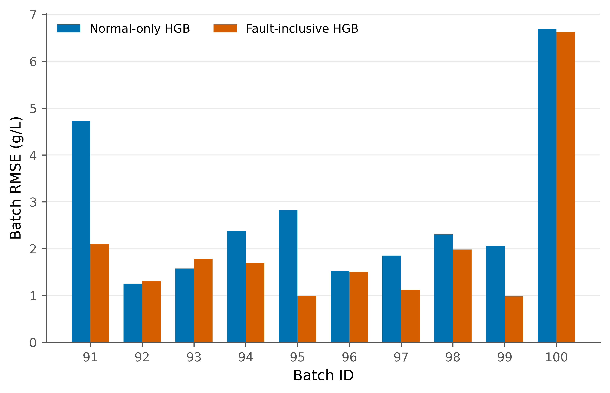

# IndPenSim penicillin soft sensor

Code, split input data and saved results for estimating penicillin concentration from simulated fermentation batches.

## Notebooks

| Study | Notebook | Purpose |
|---|---|---|
| Baseline ML | [baseline.ipynb](notebooks/baseline.ipynb) | Compares Linear Regression and Random Forest, selects the baseline model, and runs the five additional experiments. |
| Main ML | [main.ipynb](notebooks/main.ipynb) | Compares normal-only and fault-inclusive HGB using complete-batch validation; adds fault-risk, OOD and empirical error-range outputs. |

## Input CSV files

These are the original process-data split exports from the supplied Baseline ML runs. They contain 41 columns, including batch IDs and split labels, and do not contain the full Raman spectra.

| File | Rows | Purpose in the original split |
|---|---:|---|
| [train_normal_60_batches.csv](data/splits/train_normal_60_batches.csv) | 67,820 | Training data: 60 complete normal batches. |
| [validation_normal_15_batches.csv](data/splits/validation_normal_15_batches.csv) | 17,510 | Model-selection data: 15 complete normal batches. |
| [test_normal_15_batches.csv](data/splits/test_normal_15_batches.csv) | 17,080 | Normal-operation test data: 15 complete normal batches. |
| [test_fault_10_batches.csv](data/splits/test_fault_10_batches.csv) | 11,525 | Fault-test data: batches 91–100. |

Together, the four files contain 113,935 rows from 100 batches. Main ML can read this complete split directory and creates its own cross-validation folds; it does not reuse the old split labels as its test design.

| Data guide | Purpose |
|---|---|
| [data/README.md](data/README.md) | Explains which input format each notebook accepts. |
| [data/splits/README.md](data/splits/README.md) | Describes the included CSVs and their batch grouping. |
| [data/splits/manifest.json](data/splits/manifest.json) | Records column names, batch IDs, row counts and checksums for the four CSVs. |
| [data/raw/README.md](data/raw/README.md) | Points to the original full IndPenSim CSV, which is not included in these archives. |

## Saved results

Open a folder's README for the purpose of every result file.

| Folder | Purpose |
|---|---|
| [results/baseline_earlier/](results/baseline_earlier/README.md) | Baseline ML: earlier saved run, kept separate to preserve its original predictions and metrics. |
| [results/baseline/](results/baseline/README.md) | Baseline ML: current notebook's validation, normal/fault test metrics, individual predictions and baseline plots. |
| [results/experiments/](results/experiments/README.md) | Baseline ML's five experiments: repeated batch CV, time/feed ablation, fault phases, model comparison and OOD/uncertainty analysis. |
| [results/main/](results/main/README.md) | Main ML's full-run predictions, batch metrics, bootstrap comparison, warning scores and figures. |

## Fault-batch RMSE

Each pair compares the models on a fault batch excluded from fitting its predictions. Shorter bars mean smaller errors. The fault-inclusive model improves RMSE for eight of ten fault batches; batch 100 remains the most difficult.

[Per-batch results](results/main/cross_validated_batch_metrics.csv) · [Figure explanations](docs/figures/FAULT_INCLUSIVE.md)

## Figure archive

The original result images are preserved in `results/`. Paper-ready versions are organized separately.

| Figure set | Purpose |
|---|---|
| [images_300_dpi](figures/images_300_dpi/) | Organized copies of the previous/canonical outputs. |
| [images_600_dpi_original_code_output](figures/images_600_dpi_original_code_output/) | 600-DPI original-output appearance plus PowerPoint. |
| [publishable_images](figures/publishable_images/) | Publication-ready 600-DPI figures and PowerPoints; used for the README preview. |
| [paper_figures_600dpi.py](figures/paper_figures_600dpi.py) | Reproducible Python generator. |
| [image_manifest.csv](figures/image_manifest.csv) | Dimensions, DPI and checksums. |

## Supporting files

| File or folder | Purpose |
|---|---|
| [docs/FIGURES.md](docs/FIGURES.md) | Gallery of all 14 plots, with captions. |
| [docs/RESULTS_GUIDE.md](docs/RESULTS_GUIDE.md) | Explains the metrics, main results and scientific limitations. |
| [docs/REPRODUCIBILITY.md](docs/REPRODUCIBILITY.md) | Instructions for running the notebooks and checking the results. |
| [docs/README.md](docs/README.md) | Index of the supporting documentation and verification records. |
| [requirements.txt](requirements.txt) | Default package requirements for the main notebook. |
| [requirements/main.txt](requirements/main.txt) | Package versions for Main ML. |
| [requirements/baseline.txt](requirements/baseline.txt) | Separate package requirements for Baseline ML. |
| [tests/](tests/) | Checks notebook code, input data, result arithmetic, figures and documentation links. |
| [.github/workflows/checks.yml](.github/workflows/checks.yml) | Runs the repository checks automatically on GitHub. |
| [DATA_SOURCES.md](DATA_SOURCES.md) | Credits the original IndPenSim dataset and explains data licensing. |
| [CITATION.cff](CITATION.cff) | Citation details for this software repository. |
| [LICENSE](LICENSE) | MIT licence for the original code and documentation; dataset material retains CC BY 4.0 attribution. |
