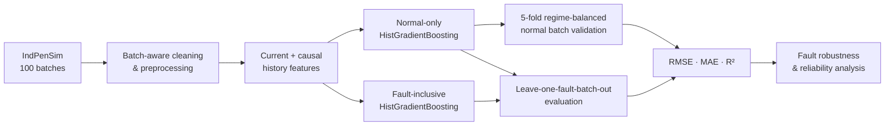

<div align="center">

# 🧫 IndPenSim Penicillin Soft Sensor

### Fault-Inclusive Machine-Learning Soft Sensing for Digital-Twin-Enabled Bioprocess Monitoring

[](https://doi.org/10.64898/2026.09.21.753176)
[](https://doi.org/10.64898/2026.09.21.753176)
[](https://www.python.org/)
[](https://scikit-learn.org/)
[](https://github.com/Lemniscabio/IndPenSim)

**Research code accompanying the bioRxiv preprint:**  
**“Towards Digital-Twin-Enabled Bioprocess Monitoring: Fault-Inclusive Soft Sensing of Penicillin Concentration Under Process Deviations”**

**Authors:** Abdul Basit Behlim · Atharva Tilewale · Dhaval Patel

[📄 Read the paper](https://doi.org/10.64898/2026.09.21.753176) 


</div>

---

## Overview

Industrial fermentation processes routinely measure variables such as temperature, pH, dissolved oxygen, agitation, feed rates and off-gas composition, while important product-quality variables such as **penicillin concentration** may be available only through slower offline measurements.

This project investigates a **machine-learning soft sensor** that estimates current penicillin concentration from routinely available process information. The central question is not only whether a model performs well during normal fermentation, but whether it remains useful when the process experiences **documented deviations/faults**.

The study therefore compares:

- a **normal-only model**, trained using normal operating batches; and
- a **fault-inclusive model**, trained with normal batches plus permitted deviation batches while strictly excluding the deviation batch being tested.

The work is designed around **batch-aware validation**, causal/current-time features, fault-focused evaluation and reliability analysis so that performance is assessed in a way that is more representative of real bioprocess monitoring.

> **Important:** this repository and paper evaluate a simulated industrial benchmark. The results do **not** by themselves establish validated deployment performance in a physical manufacturing process.

---

## Why this work matters

A soft sensor can look highly accurate if training and testing samples from the same fermentation batch are mixed together. In batch bioprocesses, that can create overly optimistic estimates because neighboring time points are strongly correlated.

This work addresses that issue by evaluating models on **complete held-out batches** and by explicitly asking how the model behaves during process deviations. The study also examines whether fault-inclusive training can improve deviation performance **without materially degrading normal-operation accuracy**.

---

## Dataset

The analysis uses the **IndPenSim industrial-scale penicillin fermentation benchmark**, which represents fed-batch penicillin production at approximately **100,000 L** scale.

| Dataset property | Value used in the study |
|---|---:|
| Total batches | **100** |
| Normal-operation batches | **90** |
| Documented deviation/fault batches | **10** |
| Total observations | **113,935** |
| Prediction target | **Current penicillin concentration (g/L)** |
| Main evaluation unit | **Complete fermentation batch** |

IndPenSim was developed as a benchmark for process monitoring, control, PAT/QbD studies and machine-learning research in industrial-scale fermentation.

---

## What was done in this project

The repository implements the computational workflow behind the study, including the following major steps:

1. **Batch-wise data preparation**  
   Process data are organized by fermentation batch so that model validation can be performed without leaking observations from a test batch into model fitting.

2. **Causal/current-time feature engineering**  
   The final comparison uses **36 current and causal history-based inputs**, allowing the model to use information available up to the current process time rather than future information.

3. **Normal-operation baseline modeling**  
   A baseline soft sensor is trained using normal-operation batches to quantify how a conventional normal-trained model behaves on both normal and deviation batches.

4. **Fault-inclusive model development**  
   A matched **HistGradientBoostingRegressor** model is trained using normal batches plus allowed deviation batches. For every deviation-batch test, that specific batch is excluded from fitting.

5. **Batch-aware model validation**  
   Normal-operation performance is evaluated using **five regime-balanced complete-batch folds**. Deviation performance is evaluated using **leave-one-fault-batch-out** testing.

6. **Reliability-oriented analyses**  
   The study also evaluates fault-risk classification, Isolation Forest out-of-distribution detection and empirical prediction/error ranges to investigate whether model confidence or process risk can be identified before large prediction errors occur.

---

## Analysis workflow


```mermaid
flowchart LR
    A[IndPenSim\n100 batches] --> B[Batch-aware cleaning\n& preprocessing]
    B --> C[Current + causal\nhistory features]
    C --> D1[Normal-only\nHistGradientBoosting]
    C --> D2[Fault-inclusive\nHistGradientBoosting]
    D1 --> E1[5-fold regime-balanced\nnormal batch validation]
    D1 --> E2[Leave-one-fault-batch-out\nevaluation]
    D2 --> E2
    E1 --> F[RMSE · MAE · R²]
    E2 --> F
    F --> G[Fault robustness\n& reliability analysis]
```

---

## Experimental design

| Component | Strategy |
|---|---|
| Primary task | Current-time penicillin concentration estimation |
| Core model family | Histogram Gradient Boosting regression |
| Final input representation | 36 current + causal history-based features |
| Normal validation | 5 regime-balanced complete-batch folds |
| Fault validation | Leave-one-fault-batch-out |
| Leakage control | Entire test batch excluded from model fitting |
| Sample weighting | Batch-balanced weighting |
| Fault-inclusive emphasis | Permitted deviation batches weighted ×3 during fitting |
| Auxiliary reliability tools | Fault-risk classifier, Isolation Forest OOD detector, empirical error ranges |

---
## Analysis notebooks

| Study | Notebook |
|---|---|
| Baseline ML | [baseline.ipynb](notebooks/baseline.ipynb) |
| Main ML | [main.ipynb](notebooks/main.ipynb) |

## Main results

### Held-out deviation batches

| Metric | Normal-only model | Fault-inclusive model | Change |
|---|---:|---:|---:|
| **RMSE (g/L)** | 3.195 | **2.564** | **−19.73%** |
| **MAE (g/L)** | 2.076 | **1.441** | Improved |
| **R²** | 0.8580 | **0.9085** | Improved |

### Normal-operation performance

| Metric | Normal-only model | Fault-inclusive model |
|---|---:|---:|
| **RMSE (g/L)** | 1.981 | 1.983 |

The fault-inclusive strategy therefore improved pooled deviation-batch performance while leaving normal-operation RMSE essentially unchanged.

Additional findings reported in the preprint include:

- **8 of 10** deviation batches showed lower RMSE with fault-inclusive training.
- The mean paired deviation-batch RMSE difference was **−0.7063 g/L**.
- A descriptive **95% batch-bootstrap interval** for the paired difference was **−1.2844 to −0.2194 g/L**.
- The benefit was strongest within the recorded fault-reference window, while late-stage prediction errors remained more difficult.
- **Batch 100** remained a challenging outlier even after fault-inclusive training (**RMSE 6.631 g/L; R² −2.4837**).

---

## Key interpretation

The central result is that exposing the model to **heterogeneous process deviations during training** can improve prediction robustness on held-out deviation batches without sacrificing ordinary operating performance on this benchmark.

However, the study also shows why a low average error is not enough for safety-critical process monitoring. Some deviations remain difficult, and auxiliary methods such as OOD detection or fault-risk classification provide only incomplete reliability information. The results should therefore be interpreted as a step toward **digital-twin-enabled soft sensing**, not as proof of production readiness.

---

## Reproducibility principles used

This project emphasizes several practices that are especially important for time-dependent batch data:

- **Split by batch, not by individual rows**
- Keep the complete evaluation batch unseen during model fitting
- Use only **current or past** information for online-style prediction
- Report normal-operation and deviation performance separately
- Inspect difficult batches rather than relying only on pooled metrics
- Compare matched models under the same validation design
- Treat OOD/risk indicators as supporting evidence, not guaranteed alarms

---

## Quick start

Clone the repository:

```bash
git clone https://github.com/abdulbasitbehlim/IndPenSim-penicillin-soft-sensor.git
cd IndPenSim-penicillin-soft-sensor
```

Create an isolated Python environment:

```bash
python -m venv .venv
```

Activate it:

```bash
# Linux / macOS
source .venv/bin/activate

# Windows PowerShell
.venv\Scripts\Activate.ps1
```

Install the scientific Python stack required by the analysis. If the repository contains a dependency file, prefer that exact file:

```bash
pip install -r requirements.txt
```

If no dependency file is present, the core workflow is based on common packages such as **NumPy, pandas, SciPy and scikit-learn** together with plotting utilities used in the analysis.

> The exact entry notebook/script can evolve with the repository. Use the analysis file(s) included in the current revision and preserve batch-level train/test separation when reproducing or extending the experiments.

---

## Extending the project

Useful next steps include prospective validation on experimental fermentation data, uncertainty calibration, explicit temporal models, adaptive/online drift handling, process-physics constraints, mechanistic–ML hybrid soft sensors and evaluation on genuinely unseen fault mechanisms.

---

## Citation

If you use this repository, its workflow, figures or results, please cite the associated bioRxiv preprint.

### BibTeX

```bibtex
@article{behlim2026digitaltwin,
  author  = {Behlim, Abdul Basit and Tilewale, Atharva and Patel, Dhaval},
  title   = {Towards Digital-Twin-Enabled Bioprocess Monitoring: Fault-Inclusive Soft Sensing of Penicillin Concentration Under Process Deviations},
  journal = {bioRxiv},
  year    = {2026},
  doi     = {10.64898/2026.09.21.753176},
  url     = {https://doi.org/10.64898/2026.09.21.753176}
}
```

GitHub-compatible citation metadata is also provided in [`CITATION.cff`](CITATION.cff).

---

## Associated paper

**Abdul Basit Behlim, Atharva Tilewale, Dhaval Patel.**  
*Towards Digital-Twin-Enabled Bioprocess Monitoring: Fault-Inclusive Soft Sensing of Penicillin Concentration Under Process Deviations.*  
bioRxiv (2026).  
**DOI:** https://doi.org/10.64898/2026.09.21.753176

---

## IndPenSim references

The benchmark used in this project builds on the industrial-scale penicillin fermentation simulator described in:

1. Goldrick, S., Ştefan, A., Lovett, D., Montague, G., & Lennox, B. (2015). *The development of an industrial-scale fed-batch fermentation simulation.* **Journal of Biotechnology, 193**, 70–82. https://doi.org/10.1016/j.jbiotec.2014.10.029
2. Goldrick, S., Duran-Villalobos, C. A., Jankauskas, K., Lovett, D., Farid, S. S., & Lennox, B. (2019). *Modern day monitoring and control challenges outlined on an industrial-scale benchmark fermentation process.* **Computers & Chemical Engineering, 130**, 106471. https://doi.org/10.1016/j.compchemeng.2019.05.037

---

## Authors

- **Abdul Basit Behlim**
- **Atharva Tilewale**
- **Dhaval Patel**

---

<div align="center">

### If this repository supports your research, please cite the paper ⭐

**Digital twins · Bioprocess monitoring · Soft sensors · Machine learning · Penicillin fermentation · IndPenSim**

</div>
