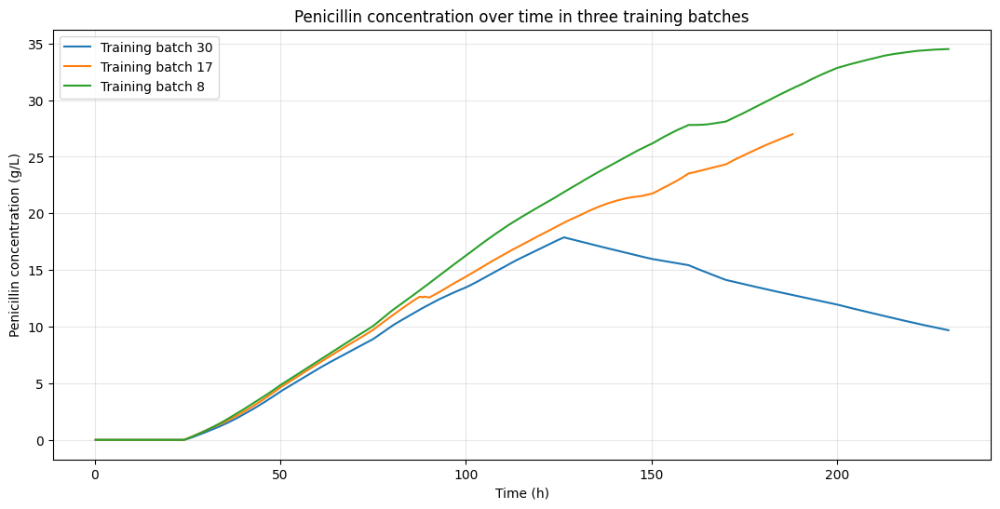
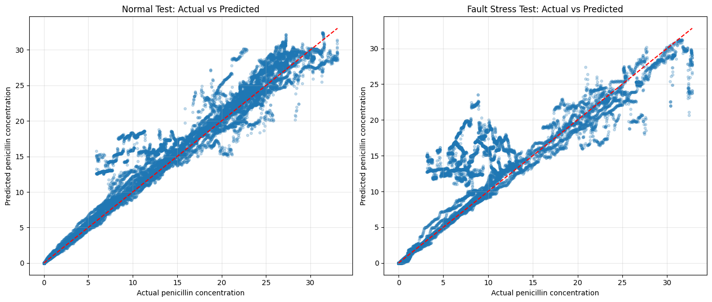
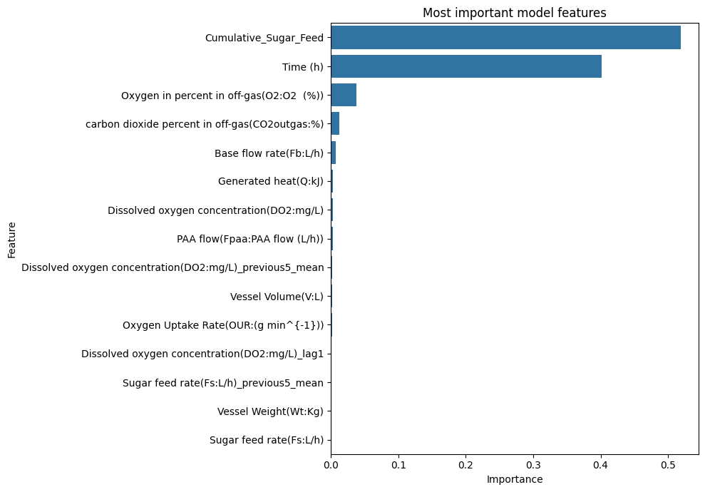

# Baseline ML — results and model selection

[All figures](../FIGURES.md) · [Five experiments](EXPERIMENTS.md) · [Main ML results](FAULT_INCLUSIVE.md) · [Baseline ML notebook](../../notebooks/baseline.ipynb)

The first study used 60 normal training batches, 15 normal validation batches and 15 normal test batches. Ten fault batches formed a separate stress test. Random Forest was selected by validation RMSE and refitted on the 75 normal development batches.

| Validation model | MAE (g/L) | RMSE (g/L) | R² |
|---|---:|---:|---:|
| Linear Regression | 1.817 | 2.539 | 0.938 |
| Random Forest | 1.228 | 2.034 | 0.960 |

The median predictor was an additional baseline. Source: [validation results](../../results/baseline/validation_results.csv).

## B1 — Training-batch concentration trajectories

**Chart type:** line plot. Each line is one training batch; time is horizontal and concentration is vertical.

- The batches start similarly but follow different later trajectories.
- Batch 30 falls after its peak; the other two continue increasing over their observed periods.
- This illustrates training-data variation. It is not a held-out prediction test.

Source: original executed baseline notebook, cell index 24. [Original PNG](../../results/baseline/figures/training_batch_trajectories.png).

## B2 — Random Forest: actual versus predicted

**Chart type:** paired scatterplots. Each dot is an observation. The dashed line marks a perfect prediction; points above it are overpredictions.

- Normal-test points lie closer to the line overall.
- Several low-concentration fault observations are predicted too high.
- Pooled RMSE is **2.181 g/L** on normal batches and **4.321 g/L** on fault batches; the pooled score can hide individual-batch failures.

Sources: [fixed-test metrics](../../results/baseline/normal_and_fault_test_results.csv), [normal batch metrics](../../results/baseline/normal_test_metrics_by_batch.csv), [fault batch metrics](../../results/baseline/fault_test_metrics_by_batch.csv). [Original PNG](../../results/baseline/figures/actual_vs_predicted.png).

## B3 — Random Forest feature importance

**Chart type:** horizontal bar chart. Longer bars indicate greater impurity-based importance in this fitted forest.

- Cumulative feed and time account for approximately **92.1%** of total importance.
- Both track batch progress, motivating the time/feed ablation.
- Importance is not a causal effect; correlated predictors can share or mask importance. The ablation is needed before claiming that the model depends entirely on these inputs.

`Cumulative_Sugar_Feed` is the code's name for accumulated feed volume in litres, not sugar mass.

Source: original executed baseline notebook, cell index 46. [Original PNG](../../results/baseline/figures/feature_importance.png). Continue to the [ablation experiment](EXPERIMENTS.md#e2--time-and-cumulative-feed-ablation).
