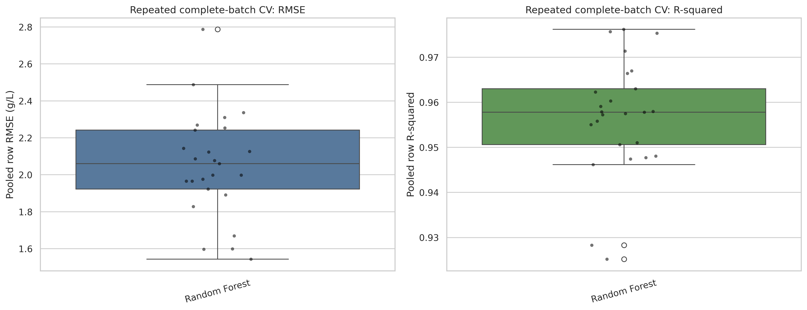
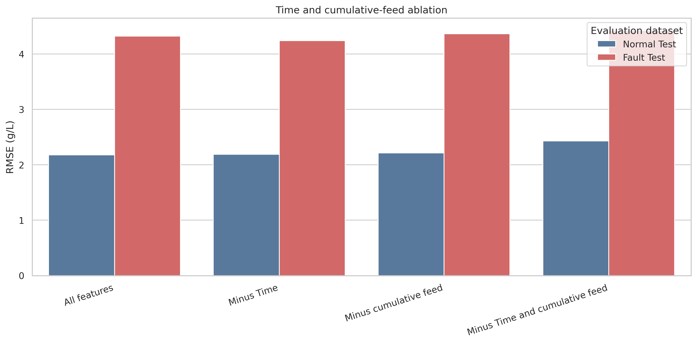
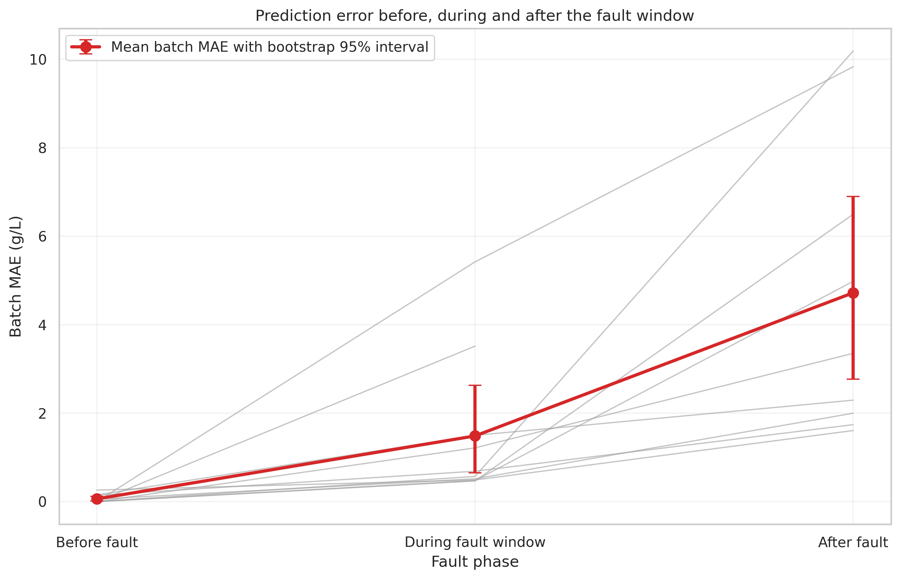
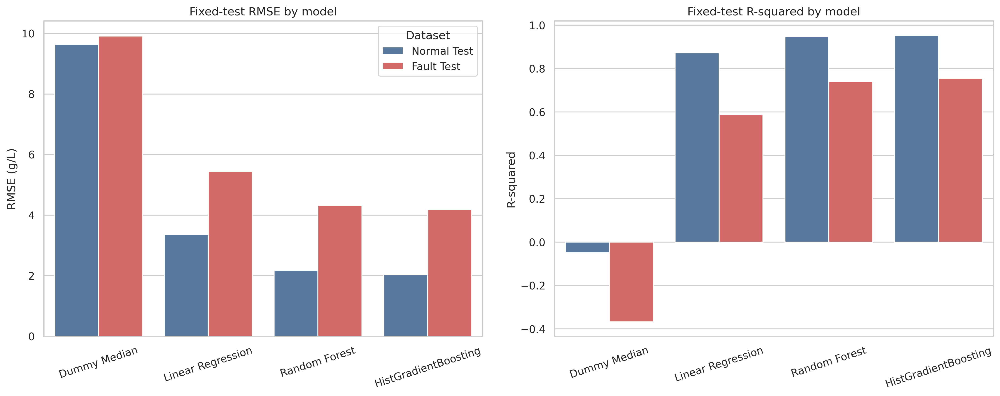
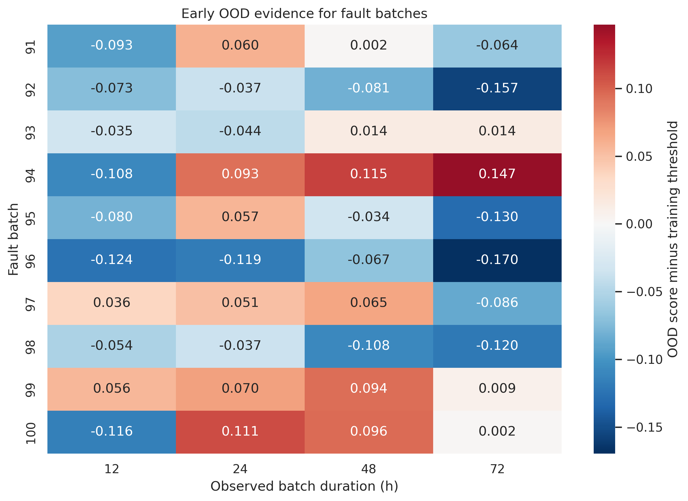
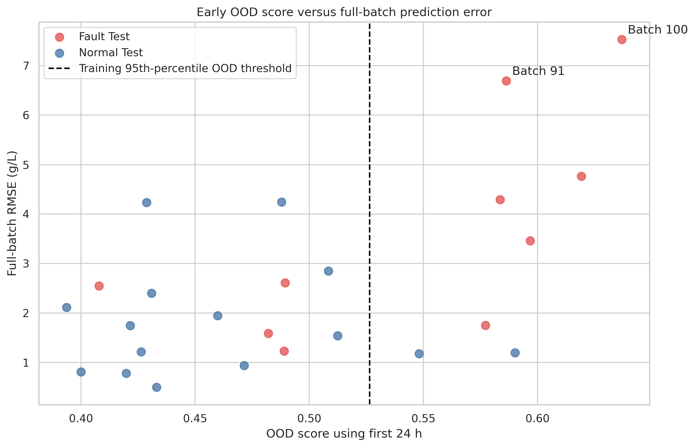

# Five diagnostic experiments

[All figures](../FIGURES.md) · [Baseline](BASELINE.md) · [Fault-inclusive results](FAULT_INCLUSIVE.md) · [Baseline notebook](../../notebooks/baseline.ipynb)

These experiments investigate the normal-trained baseline, not the later fault-inclusive HGB evaluation. The figures below are original saved outputs; each also links to its original notebook-display rendering.

## E1 — Repeated complete-batch cross-validation

**Chart type:** boxplots with individual scores overlaid.

- Five normal-batch folds are repeated five times. Each fit uses 72 complete batches for training and 18 for testing.
- The centre line is the median, the box covers the middle half of the scores, and dots reveal split-to-split variation.
- Mean pooled RMSE is **2.050 g/L**, with **SD 0.286 g/L**, across the 25 evaluations.
- The same 90 normal batches are reused. This measures split sensitivity; it does not prove the model is unbiased or fault-robust.

Sources: [fold scores](../../results/experiments/experiment_1_repeated_batch_cv_fold_metrics.csv), [summary](../../results/experiments/experiment_1_repeated_batch_cv_summary.csv). [Notebook-display PNG](../../results/experiments/notebook_outputs/experiment_1_cv_distribution.png).

## E2 — Time and cumulative-feed ablation

**Chart type:** grouped bar chart. Each pair compares normal and fault errors for one feature set.

- Four fits use all inputs, omit time, omit cumulative feed, or omit both.
- Omitting both raises normal RMSE by **11.53%** and fault RMSE by **2.44%**, relative to this experiment's own all-input refit.
- Performance does not collapse. Other inputs may still encode batch progress.
- Use the ablation's reference values, not a slightly different Random Forest refit from another experiment.

Source: [ablation results](../../results/experiments/experiment_2_time_feed_ablation.csv). [Notebook-display PNG](../../results/experiments/notebook_outputs/experiment_2_time_feed_ablation.png).

## E3 — Error before, during and after the fault window

**Chart type:** individual-batch lines with an error-bar summary.

- Grey lines show each batch's MAE. Red points show the **equal-batch mean MAE**; error bars are the saved bootstrap 95% intervals.
- Red-point values are **0.061**, **1.485** and **4.721 g/L** before, during and after the fault window.
- Pooled row MAEs are different: **0.112, 2.170 and 4.708 g/L**. Do not use them to label the red points.
- Only nine batches contribute an after-window segment. A cleared reference does not prove recovery; the first-to-last window can include inactive gaps.

Sources: [phase summary](../../results/experiments/experiment_3_fault_phase_overall.csv), [per-batch phases](../../results/experiments/experiment_3_fault_phase_by_batch.csv). [Notebook-display PNG](../../results/experiments/notebook_outputs/experiment_3_fault_phase_mae.png).

## E4 — Stronger model comparison

**Chart type:** paired grouped bar charts. Left is pooled RMSE; right is pooled R². This is **not** a mean-batch-error plot.

| Model | Normal RMSE (g/L) | Fault RMSE (g/L) |
|---|---:|---:|
| Dummy Median | 9.647 | 9.916 |
| Linear Regression | 3.355 | 5.448 |
| Random Forest | 2.181 | 4.321 |
| HistGradientBoosting | 2.030 | 4.190 |

- Each substantive normal-trained model has larger fault errors: the difficulty is not confined to Random Forest.
- HGB improves fault RMSE versus RF here, but has slightly worse fault MAE. Ranking depends on the metric.
- This HGB configuration and evaluation differ from the final study; it is not the final normal-only reference.

Source: [comparison results](../../results/experiments/experiment_4_model_comparison_test.csv). [Notebook-display PNG](../../results/experiments/notebook_outputs/experiment_4_model_comparison.png).

## E5a — Early out-of-distribution warnings

**Chart type:** annotated heatmap. Rows are batches; columns are observed durations.

- Each entry is **OOD score minus that horizon's training-derived threshold**. Positive values trigger warnings; negative values do not.
- At 24 h, **6/10 fault batches** and **2/15 normal-test batches** are flagged.
- OOD means unfamiliar input behaviour, not proof of a fault or a direct estimate of concentration error.
- Batches 91 and 100 have a recorded 20-h onset. Their 24-h warnings are not pre-onset predictions.

Sources: [early scores](../../results/experiments/experiment_5_early_ood_scores.csv), [warning summary](../../results/experiments/experiment_5_ood_evaluation_summary.csv), [onset audit](../../results/experiments/experiment_3_fault_onset_audit.csv). [Notebook-display PNG](../../results/experiments/notebook_outputs/experiment_5_fault_ood_heatmap.png).

## E5b — Early OOD score versus full-batch error

**Chart type:** scatterplot with a threshold line. Each point is one batch.

- Moving right means more unusual inputs in the first 24 h; moving up means larger full-batch error.
- The dashed line is the threshold. This x-axis uses the **raw OOD score**, not the threshold-subtracted value in the heatmap.
- Batches 91 and 100 are unusual and difficult in this experiment, but not every high-error batch is flagged and not every warning implies high error.
- Companion ranges targeting 90% coverage achieved **84.89%** normal and **70.41%** fault row coverage. The supplied run did not produce a separate coverage plot.

Sources: [OOD/error table](../../results/experiments/experiment_5_ood_uncertainty_by_batch.csv), [uncertainty summary](../../results/experiments/experiment_5_uncertainty_summary.csv). [Notebook-display PNG](../../results/experiments/notebook_outputs/experiment_5_ood_vs_batch_rmse.png).
