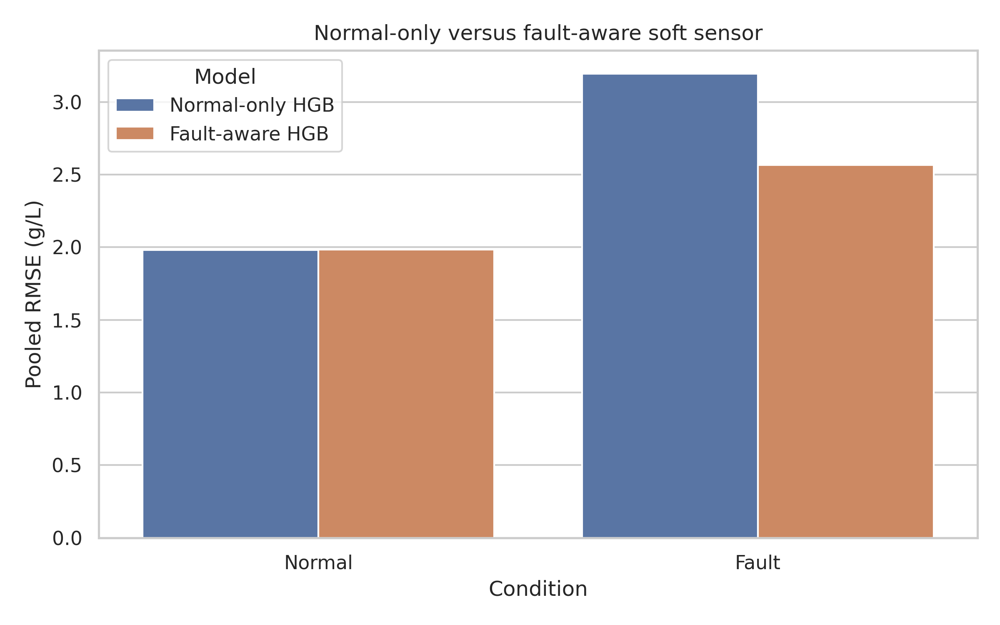
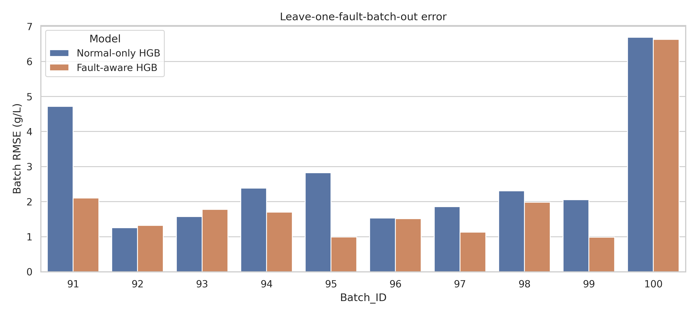
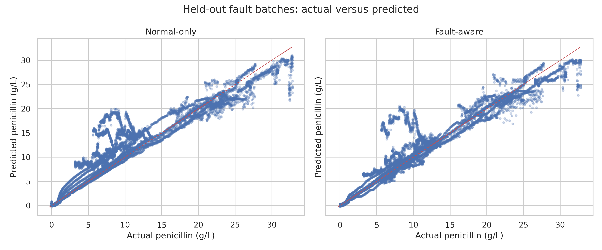
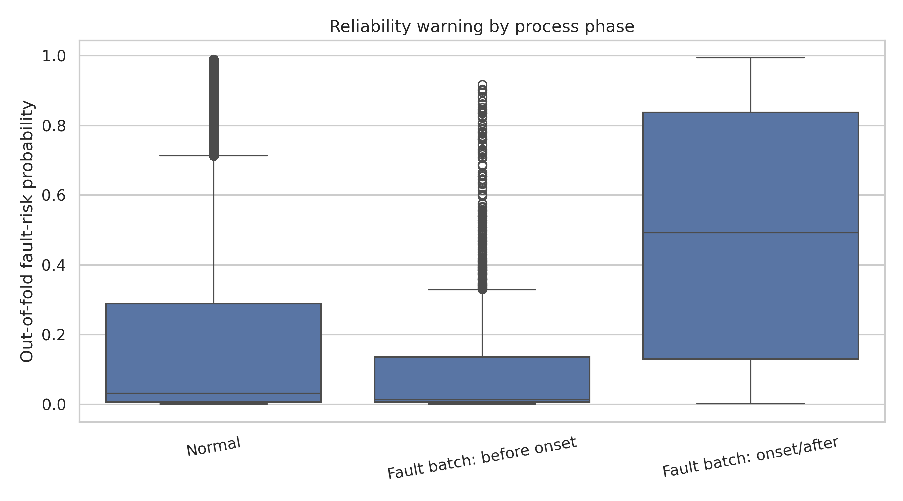
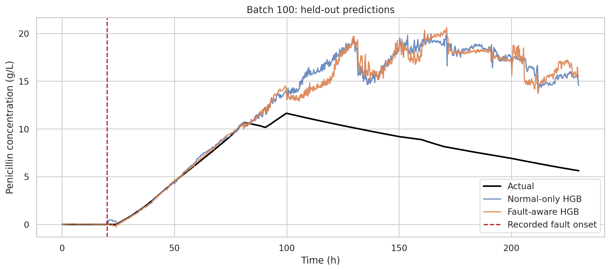

# Main ML — fault-aware soft-sensor results

[All figures](../FIGURES.md) · [Baseline ML](BASELINE.md) · [Five experiments](EXPERIMENTS.md) · [Main ML notebook](../../notebooks/main.ipynb)

Two HGB regressors are compared. The normal-only model learns from normal batches; the fault-inclusive model also learns from other fault batches, with a fault weight multiplier of three. Each test batch is excluded from fitting its own predictions.

Normal evaluation uses five folds with 18 normal test batches each. Fault evaluation holds out one fault batch at a time; the fault-inclusive model can use the other nine. This is batch-held-out evaluation, not fault-mechanism-held-out evaluation.

## F1 — Overall held-out RMSE

**Chart type:** grouped bar chart. Shorter bars mean smaller errors.

| Held-out group | Normal-only RMSE (g/L) | Fault-inclusive RMSE (g/L) |
|---|---:|---:|
| Normal | 1.9806 | 1.9830 |
| Fault | 3.1946 | 2.5644 |

- Fault RMSE falls by **19.73%**, with little change in normal RMSE.
- Bars pool held-out observation rows; they are not means across independent repetitions.
- The original label **Fault-aware HGB** refers to the same model called **fault-inclusive HGB** here.

Source: [overall metrics](../../results/main/cross_validated_overall_metrics.csv).

## F2 — Error for each fault batch

**Chart type:** grouped bar chart, with a pair for each fault batch.

- Eight batches improve in RMSE; **92 and 93 worsen**.
- Batch 100 retains the largest error, despite a small reduction.
- The pooled improvement does not establish that every fault is handled correctly.

Sources: [per-batch metrics](../../results/main/cross_validated_batch_metrics.csv), [paired-batch summary](../../results/main/paired_batch_bootstrap.csv).

## F3 — Actual versus predicted concentration

**Chart type:** paired scatterplots. The dashed line marks perfect predictions.

- Fault-inclusive pooled fault R² is **0.9085**, compared with **0.8580** for normal-only training.
- Some low-production observations remain above the line: overprediction persists.
- Each dot is an observation, not an independent fermentation. The points come from ten held-out fault batches.

Sources: [predictions](../../results/main/cross_validated_predictions.csv), [overall metrics](../../results/main/cross_validated_overall_metrics.csv).

## F4 — Separate fault-risk score by phase

**Chart type:** boxplots. The centre line is the median; the box covers the middle half of the scores.

- Onset/after observations generally receive higher scores, but the groups overlap substantially.
- At threshold 0.5, warnings occur for **13.86%** of normal rows, **4.64%** of pre-onset rows and **49.26%** of onset/after rows.
- The original axis says “probability”, but the class-weighted model is not independently probability-calibrated. Treat it as a warning score.
- This classifier is separate from the concentration regressor and OOD detector; its warning does not correct the concentration estimate.

Source: [fault-risk summary](../../results/main/fault_risk_summary.csv). AUC **0.8434** compares pre-onset and onset/after observations within fault batches, not all normal batches against all fault batches.

## F5 — Batch 100: the unresolved failure

**Chart type:** time-series line plot. Black is actual concentration; blue and orange are predictions. The vertical line marks recorded onset.

- Both models follow the early rise but miss much of the later decline.
- Fault-inclusive RMSE remains **6.631 g/L**, with **R² = −2.4837**.
- Negative R² means worse performance than using this batch's own mean as a retrospective reference. It is not a negative accuracy percentage.
- The overall improvement does not remove this low-production failure mode.

Sources: [per-batch metrics](../../results/main/cross_validated_batch_metrics.csv), [predictions](../../results/main/cross_validated_predictions.csv).

The final bundle is refitted on all 100 labelled batches after evaluation. Its [deployment diagnostics](../../results/main/deployment_reliability_by_batch.csv), OOD flags and empirical ranges are not another held-out accuracy test. The supplied run produced no separate final OOD figure; those results remain in their original tables.
